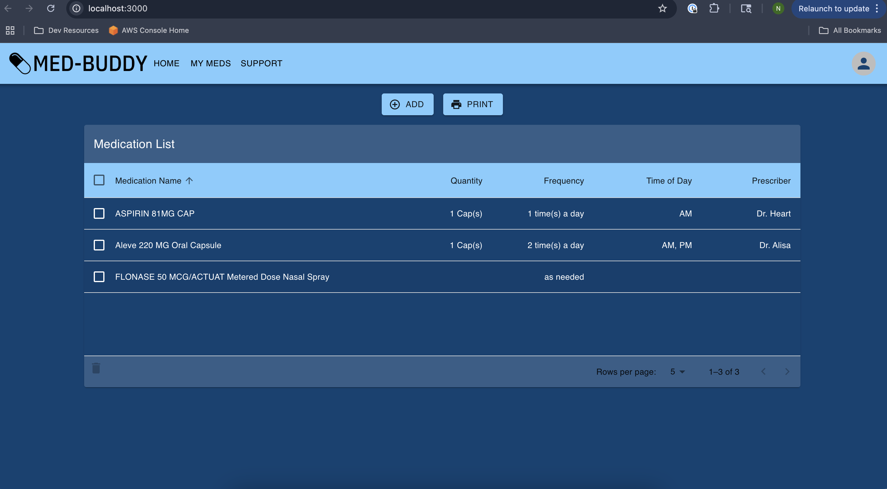
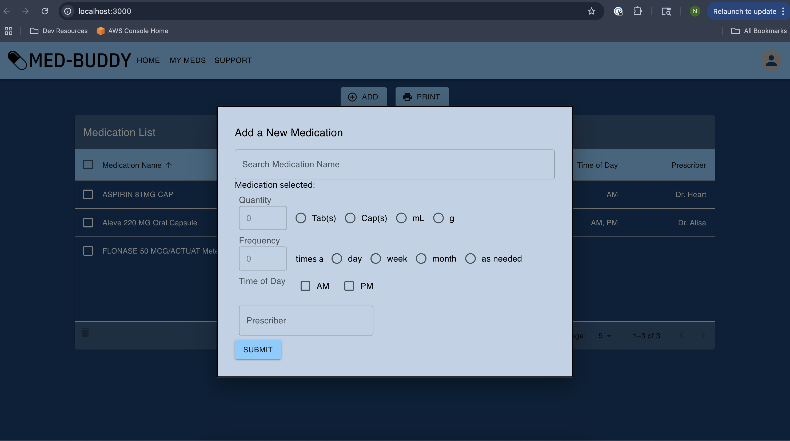

# Med-Buddy

Med-Buddy is a React-based web application designed to help users manage their medications.

## Features

- Medication Management: Add, update, and remove medications as your prescription changes.
- Prescription Details: Keep track of dosage, doctor information, and more.




## Dependencies

- React ^18.2.0
- React-DOM ^18.2.0
- @emotion/react ^11.11.0
- @emotion/styled ^11.11.0
- @mui/icons-material ^5.11.16
- @mui/material ^5.13.4
- react-router-dom ^6.3.0
- react-window ^1.8.9
- axios ^1.4.0
- Express ^4.18.2
- Morgan ^1.10.0
- Nodemon ^2.0.22
- pg ^8.11.0
- @babel/plugin-proposal-private-property-in-object ^7.21.11
- @auth0/auth0-react ^1.12.0
- web-vitals ^2.1.4

## Getting Started

1. Clone the repository to your local machine.
    ```
    git clone https://github.com/Neeki-Askari/med-buddy.git
    ```
2. Navigate to the cloned directory.
    ```
    cd mvp-med-buddy
    ```
3. Install the necessary dependencies.
    ```
    npm install
    ```
4. Start the development server.
    ```
    npm run server
    ```
5. In a new terminal tab, start the React application.
    ```
    npm run start
    ```

## Available Scripts

In the project directory, you can run:

### `npm run server`
Runs the backend server.

### `npm run start`
Runs the app in the development mode. Open [http://localhost:3000](http://localhost:3000) to view it in the browser.

### `npm run build`
Builds the app for production to the `build` folder.

### `npm run eject`
**Note: this is a one-way operation. Once you `eject`, you can’t go back!**
If you aren’t satisfied with the build tool and configuration choices, you can `eject` at any time.

## Contributing

Pull requests are welcome. For major changes, please open an issue first to discuss what you would like to change.

## Acknowledgements

Med-Buddy was built using React, Express, PostgreSQL, and Material-UI. Many thanks to their developers for making these resources available.


